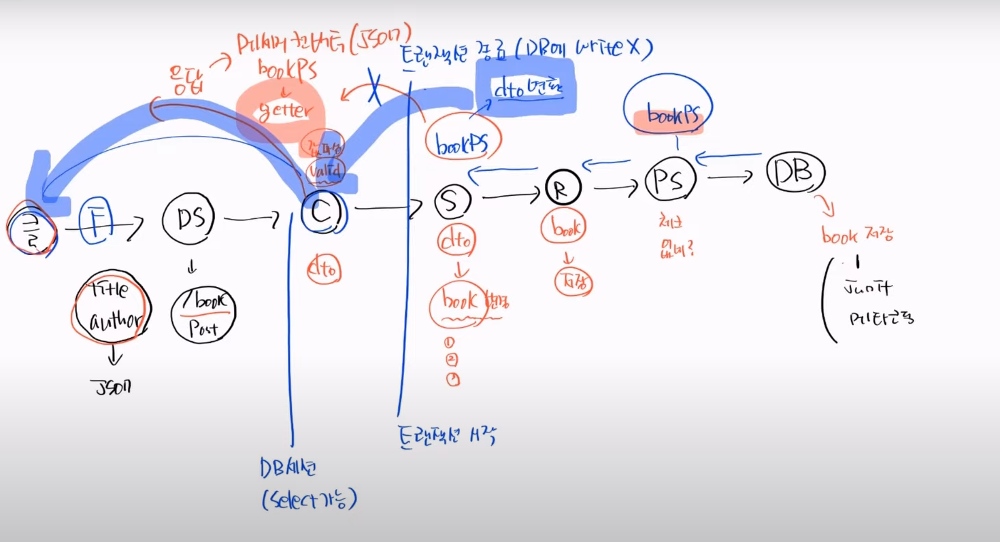
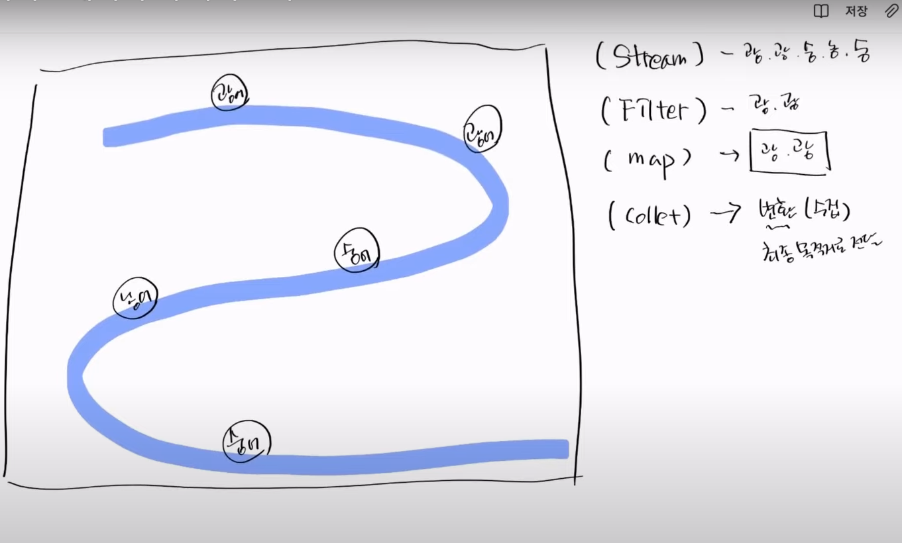

# 테스트 순서
1. Repository
    - DB쪽 관련 테스트
2. Service
    - 로직 트랜잭션 테스트
3. Controller
    - 클라이언트와 테스트

## 1. RepositoryTest
- @DataJpaTest : 부분 테스트를 위한 어노테이션 (DB에 관한 클래스만 띄움)

# 테스트 메서드 실행
- primary key auto_increment 값 초기화 안됨  (@Sql 이용해 해결)
- >  @Sql("classpath:db/tableInit.sql") 
  > 메서드 실행마다 해당 경로에있는 sql 파일 sql 문 실행

# ResponseDto 사용 이유 

1. client 가 값을 보냄
2. controller 는 받은 값을 service 에 보냄
3. service 는 받은 값(dto)을 entity 로 변환하여 레포지터리에 저장
4. service 는 controller 에 값을 반환함 이 때 entity 자체를 반환해버리면 스프링은 해당 entity 에 있는 연관 클래스까지 모두 getter 해서 값을 반환해버림
5. 이것을 해결하기 위에 따로 ResponseDto 를 만들어 반환해줄 값만 만들어 controller 에 값 반환

# Stream 이란 
(BookService.책_목록_조회)

1. Stream 에 데이터들이 담겨있음(Object 형태로)
2. Filter 로 원하는 데이터들만 필터링 함 ( 여기선 안썼음 )
3. 필터링한 데이터를 map 안에 넣어둠(new ResponseDto:: toDto) 왼쪽 객체의 오른쪽 메소드 사용
4. collect 를 이용해 map(object) 의 형태를 원하는 형태로 변환
